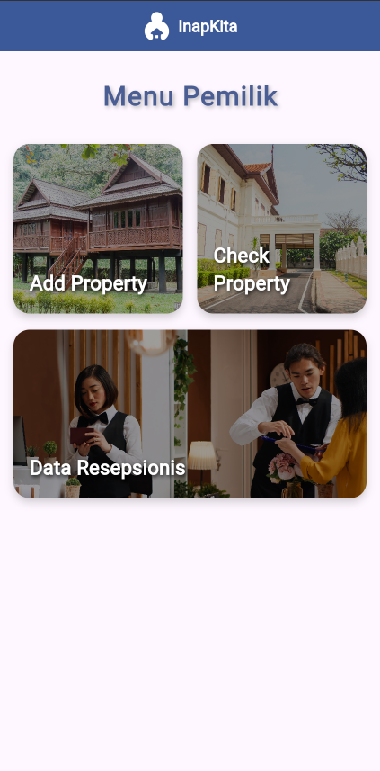
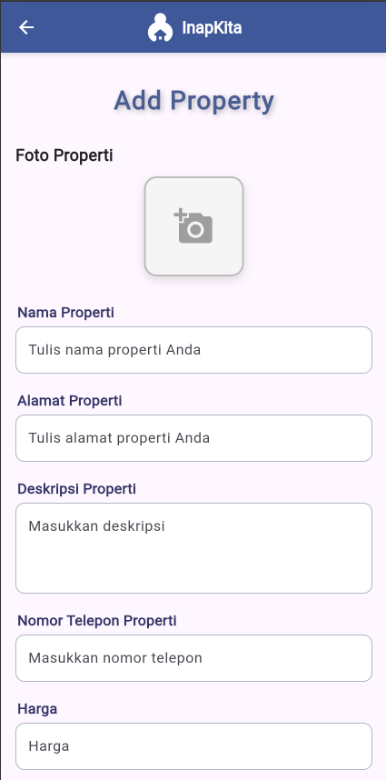

# test_pemilk_flutter_application

Aplikasi Flutter modern untuk manajemen properti, dirancang untuk memudahkan pengelolaan listing properti, check-in, dan data resepsionis.

## Fitur Unggulan
- Tambah & kelola data properti
- Cek detail properti
- Manajemen data resepsionis
- Navigasi splash screen & home screen
- Dukungan lintas platform: Android, iOS, Web, Windows, macOS, Linux

## Cuplikan Layar
<p align="left">
  
  <br/>
  <em>Home Screen</em>
</p>
<p align="left">
  
  <br/>
  <em>Splash Screen</em>
</p>

## Mulai Cepat

### Prasyarat
- [Flutter SDK](https://flutter.dev/docs/get-started/install)
- Dart SDK (sudah termasuk dalam Flutter)
- Android Studio, VS Code, atau IDE favorit Anda

### Instalasi
1. Kloning repositori:
   ```sh
   git clone https://github.com/yourusername/test_pemilk_flutter_application.git
   cd test_pemilk_flutter_application
   ```
2. Install dependensi:
   ```sh
   flutter pub get
   ```
3. Jalankan aplikasi:
   ```sh
   flutter run
   ```

## Struktur Proyek
- `lib/` - Sumber kode utama Dart
  - `main.dart` - Titik masuk aplikasi
  - `home_screen.dart`, `splash_screen.dart`, `add_property.dart`, `check_property.dart`, `data_resepsionis.dart` - Layar & logika utama
- `assets/images/` - Gambar aplikasi
- `assets/readme_images/` - Gambar untuk dokumentasi README
- `android/`, `ios/`, `web/`, `windows/`, `macos/`, `linux/` - Kode spesifik platform
- `test/` - Unit test & widget test

## Dependensi

**dependencies:**
- flutter (SDK)
- cupertino_icons: ^1.0.8
- image_picker: ^1.0.7

**dev_dependencies:**
- flutter_test (SDK)
- flutter_lints: ^5.0.0

Lihat daftar lengkap di `pubspec.yaml`.

## Kontribusi
Kontribusi sangat terbuka! Silakan buat issue atau pull request untuk perbaikan dan pengembangan fitur.

## Lisensi
Proyek ini dilisensikan di bawah MIT License.

---

Informasi lebih lanjut: [Dokumentasi Flutter](https://docs.flutter.dev/)
